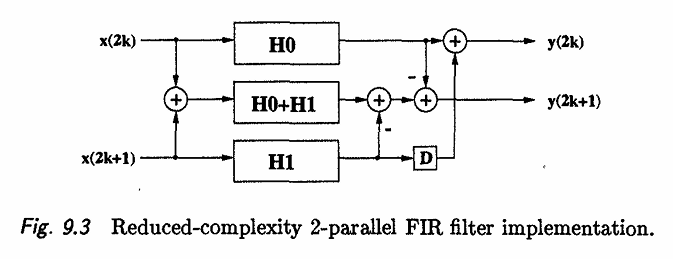

# FIR Filter Design Project

## Filter Design

The filter was designed using Matlab's filterDesigner to get a 150-tap equiripple low-pass FIR filter. The cutoff is between 0.2&pi; and 0.23&pi; radians/sample. The passband has a maximum output magnitude of 2.3dB and the stopband has a maximum output magnitude of -80dB. The frequency response is shown below.

  

The filter coefficients were then quantized to be 16 bit signed, fixed point values with 15 fraction bits. Therefore, the coefficients can range from -1 to 0.99996948242..., which is a wide enough range to include the largest and smallest filter coefficients generated by Matlab. Quantizing the filter coefficients distorts the frequency response, which is shown by the image below. The output magnitude in the stopband is more erratic and sometimes rises above the -80dB level achieved by the non-quantized filter. However, the general shape is intact and it will still function as a low-pass filter with the desired cutoff range.

  

The Matlab script filter_design.m generates and quantizes the filter coefficients, then saves them to a SystemVerilog file called filter_parameters.sv that is used by all implementations of the filter.

## Hardware Design

The filters are designed using SystemVerilog. They include the filter_parameters.sv file that was generated by Matlab to get the filter coefficients.

### Pipelined Filter Design
The pipelined filter with no parallelization implements the transposed form FIR filter. can be found in src/pipelined_fir_filter.sv.

<figure>

  

<figcaption>Image source : https://www.researchgate.net/figure/FIR-filter-in-transposed-form_fig1_3915743</figcaption>
</figure>

### Parallel Filter Design
The parallel filters can be found in src/parallel_fir_filter.sv. The parameters can be adjusted to choose L=2 or L=3 and to determined whether the sub-filters will use a pipelined filter architecture (set USE_PIPELINING=1) or a non-pipelined architecture (USE_PIPELINING=0).

The parallel filters are made up of subfilters (implemented by the FIR_Filter module inside parallel_fir_filter.sv). If L=2, it will instantiate 3 subfilters (H0, H1, H0+H1). If L=3, it will instantiate 6 subfilters (H0, H1, H2, H0+H1, H1+H2, H0+H1+H2). If USE_PIPELINING is set to 1, the subfilters use the same pipelined architecture as the non-parallel pipelined filter. Otherwise, they will implement the direct-form FIR filter with a very long critical path.

The images below show the reduced-complexity architectures used for L=2 and L=3. The subfilters are length N_TAPS/L. Therefore, when L=2 the subfilters have length 75 and when L=3 they have length 50.

<figure>

  

<figcaption>Image source : K.K. Parhi, VLSI Digital Signal Processing Systems: Design and Implementation</figcaption>
</figure>

<figure>

  

<figcaption>Image source : K.K. Parhi, VLSI Digital Signal Processing Systems: Design and Implementation</figcaption>
</figure>

### Overflow
The inputs and coefficients are both 16 bits (signed fixed point with 15-bit fractions). Multiplying an input and a coefficient gives at maximum a 32-bit fixed point number with 30 fraction bits to avoid overflow. Then, it adds 150 of these 32-bit numbers which results in a maximum of 32 + ceil(log2(150)) = 40 bits to avoid overflow in the output. In my implementations, the output is 40 bits to ensure that it hold the entire calculated result. However, the output can be made smaller by taking the upper X bits. For example, to get a 16-bit output, it would need to do output16bits = output40bits[39:24].

## Results

The filters were simulated in ModelSim and synthesized in Xilinx Vivado.

### ModelSim Simulation
There are separate testbenches for the pipelined and parallel filters (src/testbench_pipelined.sv and src/testbench_parallel.sv) but they basically work the same way. Every clock cycle, the testbench computes a sample of a sine wave of a certain frequency and provides it at the input of the filter. For the parallel filters, it generates L samples of the sine wave. After the frequency has been at the input of the filters for more than 150 clock cycles (the length of the filter), the output magnitude is monitored over a few cycles of the frequency to get the approximate output magnitude. This is repeated with 14 different frequencies (including DC input) to get a rough outline of the frequency response.

The testbench uses a clock with a period of 50ns. For L=1, this results in a sampling period of 50ns since the filter takes 1 input every clock cycle. For L=2, the samping period is 25ns since it reads 2 samples every clock cycle. For L=3, the sampling period is 16.6667ns. The parallel filters are able the double or triple the sampling frequency despite using the same clock speed as the non-parallel filter.

The results from the testbench are saved as .csv files in the testbench_results folder. The graphs below show the output magnitude for the non-parallel pipelined filter as an example. All of the results are very similar and match up with the filter characteristics. The input frequencies are provided as a proportion of the sampling frequency Fs. The sampling frequency is 2&pi; radians, so X\*Fs is 2X&pi; radians/sample. Therefore, the cutoff of 0.1000\*Fs to 0.1150\*Fs is 0.2&pi; to 0.23&pi; radians/sample.

  

### Vivado Synthesis

The filters were syntesized using Vivado 2023.2. Vivado provides timing reports that estimate the time of the critical path.
The images below show examples of the reports that Vivado provides, for the 2-parallel filter with no pipelining. The first is the timing report, which shows the longest 5 paths in the design. The critical path here takes 55.847ns total, with 43.015ns due to the logic and 12.832ns due to the delay on the wires. The slack is -5.976ns, which indicates that the path takes longer than the clock cycle and this design would need to have a slower clock in order to run properly.

  

Next is the utilization report, which shows how many look-up tables, registers, and DSPs the design would take if it were implemented on an FPGA. The image shows that the 2-parallel filter with no pipelining would take a total of 7728 look-up-tables, 3538 registers and 178 DSPs.

  

Lastly, a rough power estimate is provided. The image shows that the total on-chip power is estimated to be 0.174W, with 0.081W of that being static power and 0.093W being dynamic power.

  

These reports were run for every combination of filters and the results are provided in the table below.

| Filter Type                  | Critical Path Delay (ns) | LUTs Required | Registers Required | DSPs Required | Esimated Total Power (W) |
| -----------------------------| ------- | ------- | ------- | ------- | ------- |
| **Pipelined**                | 0.967   | 0 | 40 | 150 | 0.134 |
| **2-Parallel Pipelined**     | 2.611   | 112 | 80 | 225 | 0.16 |
| **3-Parallel Pipelined**     | 2.937   | 6663 | 2543 | 239 | 0.203 |
| **2-Parallel Non-pipelined** | 55.847  | 7728 | 3538 | 128 | 0.174 |
| **3-Parallel Non-pipelined** | 39.149  | 14976 | 4058 | 181 | 0.216 |

All of the filters that use pipelining have similar critical path delays between 0.967-2.937ns, and the non-pipelined filters had larger critical path delays of 39-55ns. This is because the critical paths of the non-pipelined filters have about 150 additions and 1 multiply, whereas the pipelined filters have critical paths of 1 addition and 1 multiply. Therefore, the pipelined filters can be run with a much faster clock than the non-pipelined filters and are capable of a much higher sampling rate.

In general, the utilization increases as L increases. Looking at the pipelined cases, the non-parallel has the lowest utilization, then the 2-parallel, and finally the 3-parallel has the largest. This makes sense because for larger L we add more subfilters and thus more area to the design. The subfilters do decrease in length but not enough to make up for the increase in number of filters (e.g. L=1 has 1 filter of length 150, L=3 has 6 filters of length 50). Therefore, if space is more critical than speed, it might be better to implement a non-parallel filter. For some reason, the non-pipelined cases have much larger utilizations even though theoretically they should be pretty similar. I think this may be because these designs are difficult for the tools to optimize with such an unrealistically long critical path.

Finally, the power consumption is just a rough estimate by Vivado. It would probably change depending on which FPGA this was implemented on or other factors. However, the overall trend shows that as L increases, so does power consumption. This is because more parallelized designs have to do more logic each clock cycle to process multiple samples. This results in a trade-off between sampling speed and power. In low power applications, it might be better to use a non-parallel filter. However, when sampling speed is critical, it might be better to use a parallel filter to increase the sampling speed despite the increase in power consumption.

Overall, the pipelined cases have much lower critical path delays, lower utilization, and similar power consumption when compared to the non-pipelined cases.
The parallel cases have similar critical path delays, higher utilization, and higher power consumption when compared to the non-parallel case.