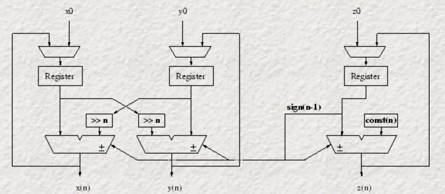
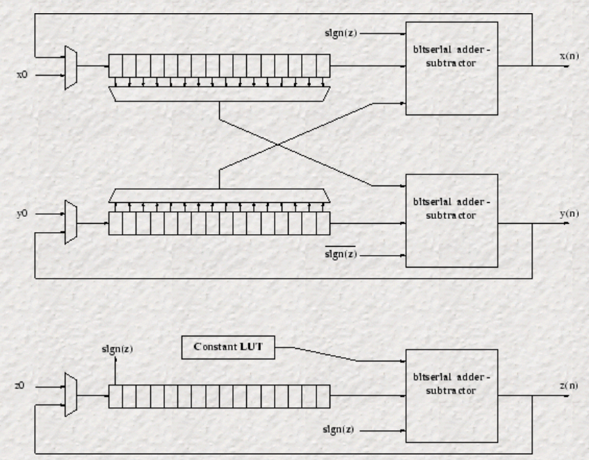
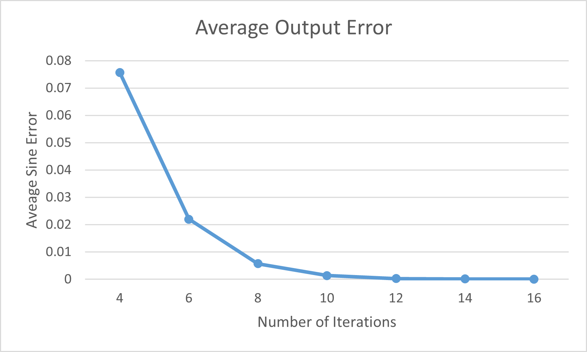

# CORDIC Algorithm

This project implements the CORDIC algorithm with several different techniques and compares the critical path delay and device utilization on an FPGA. The CORDIC algorithm is a method of computing trigonometric functions using only add and shift operations. Alternative methods of comuting trig functions include lookup tables or polynomial expansions. Lookup tables can be expensive to implement, especially when high accuracy is desired, and polynomial expansions algorithms require many multiplicaitons. Therefore, CORDIC is useful when no hardware multiplier is available or to avoid building a very large lookup table.

## CORDIC Overview

CORDIC works by successively rotating a vector until it reaches the desired angle a. Intuitively, it approximates the angle by rotating the vector by angles of decreasing sizes until the vector is pointed in the direction of angle a. It starts with a vector at 0 degrees. If a > 0 degrees, then it rotates counter-clockwise by 0 degrees. Otherwise, it rotates clockwise. Now it has a vector v' at a' = ±45 degrees. During the next iteration, it halves the rotation angle and repeats the process: if a' < a, then it rotates counter-clockwise by 22.5 degrees (actually 26.6), otherwise it rotates clockwise. This process continues for N iterations. Each iteration, the vector is rotated in the direction of angle a and the rotation angle is decreased for the next iteration. At the end, v is approximately in the direction of angle a.

To implement this, we need a way to rotate the vector efficiently. After rotating a vector v = (x,y) counter-clockwise by angle $\phi$, the resulting vector is v' = (x',y') = (cos($\phi$)(x-ytan($\phi$)), cos($\phi$)(y+xtan($\phi$))). Computing x' and y' requires a multiplication by tan($\phi$) and cos($\phi$). To make the multiplcation by tan($\phi$) much more efficient, we can choose $\phi$ such that tan($\phi$) is a multiple of two and the operation becomes a shift instead of a multiply.

The choices for $\phi$ for 4 iterations are shown in the table. The rotation angle decreases each iteration so that the vector narrows in on the actual angle. The multiplications by tan($\phi$) can be accomplished by left shifts which are much cheaper than multiplies.

| Iteration | Rotation Angle $\phi$ (degrees) | tan($\phi$) |
| --------- | ----------------------- | ----------- |
| 0 | 45 | 1 |
| 1 | 26.57 | 1/2 |
| 2 | 14.04 | 1/4 |
| 3 | 4.13 | 1/8 |

Since both x' and y' are multiplied by cos($\phi$) every iteration, there  will be a constant scale factor of S=cos(45)cos(26.57)...cos(atan(1/N)) on the result after N iterations. A division can be avoided by initializing the first vector with a magnitude of S instead of 1. Therefore, the initial vector pointing at 0 degrees will be (S,1).

After N iterations, the output will be sin(a) = y' and cos(a) = x'.

# Hardware Architectures

Several different hardware implementations of the CORDIC algorithm are considered in this project.

## Iterative
The first hardware implementation of CORDIC computes one iteration of the algorithm each clock cycle. To compute N iterations, it requires N clock cycles. Therefore, the latency will be N clock cycles and it will output on average 1/N samples/clock cycle. This implementation saves on area and power but is not very fast.

The diagram shows the computation of a single iteration. The hardware is the same for each iteration, except it needs to track the iteration number n so it knows by how much it should do the bitshifting. This leads to some additional  overhead involved in keeping track of which iteration the algorithm is on.

<figure>

  

<figcaption>Image source : https://cnmat.org/~norbert/cordic/node6.html</figcaption>
</figure>

One of the benefits of the iterative implementation is that the accuracy of the output can be improved without increasing the area of the design. However, it will cause an increase in latency since accuracy improvements require increasing N.

## Loop Unrolled / Pipelined
The loop in the previous hardware implementation can be unrolled and pipelined. Each pipeline stage computes one iteration of the CORDIC algorithm. For a configuration requiring N iterations, there are N pipeline stages. This results in N times the hardware of the iterative implementation, so the design will increase in area and power consumption. The latency is still N clock cycles. However, it can now output 1 sample/clock cycle. The counter from the iterative implementation can be removed because the iteraiton number is determined by which pipeline stage the data is at.

This implementation can be adjusted by changing how many iterations are in each pipeline stage. If the pipeline registers are placed every 2 clock cycles, then the latency becomes N/2 clock cycles with the same amount of hardware. However, because an iteration depends on the output of the previous iteration, this will increase the critical path delay.

## Bit serial
The previous implementations are bit-parallel because they operate on all the bits at once. In a bit-serial implementation, the additions are computed one bit at a time. Each iteration will take 16 clock cycles to compute the addition of the 16-bit numbers, but the critical path is much faster so it can be driven with a much faster clock. The diagram shows the hardware for a single iteration using bit serial adders.
<figure>

  

<figcaption>Image source : https://cnmat.org/~norbert/cordic/node8.html</figcaption>
</figure>

# Results
All designs were simulated with Modelsim using testbench.sv to verify that the outputs are correct. The test inputs were angles between 0 to 1.5 radians in increments of 0.1 radians.

## Output Error
When computing sin(a) with N iterations, the algorithm will compute sin(a') for some angle a' within atan(1/N) radians of a. Therefore, the output error will be bounded by sin(arctan(1/N)). For N = 14, the maximum output error is 0.062378286. In practice, the average error of the output is much lower than the theoretical maximum. The average output error for different iteration lengths is graphed below.

<figure>

  

</figure>

## Vivado Synthesis
The designs were also synthesized using Xilinx Vivado to compare device utilization and critical path length. The table shows the delay of the critical path in each design. The iterative and pipelined have almost the same critical path, because each pipeline stage is essentially the same as the iterative design. The pipelined implementation that computes 2 iterations in a single clock cycle has the longest critical path. This implementation can compute 1 CORDIC iteration every 2.3875ns, which is an improvement on the basic pipelined implementation that does 1 iteration every 3.075ns. The bit serial has the lowest critical path, but it's still not enough to make up for taking more clock cycles for each iteration due to doing the addition one bit at a time. This could probably be optimized a bit more by adjusting the control logic.

| Algorithm                  | Critical Path Delay (ns) |
| -------------------------------| ------- |
| **Iterative**                  | 3.098   |
| **Loop Unrolled/Pipelined**    | 3.075   |
| **2 Loop Unrolled/Pipelined**  | 4.775   |
| **Bit Serial**                 | 2.653   |

The next table shows the device utilization when implemented in an FPGA. The iterative and bit serial implementations were the smallest because they only have hardware to compute a single iteration at one time. The pipelined implementations use more registers because they need to have pipeline registers for each stage, and also they use more LUTs because they need to be computing N = 8 different iterations at once. The two pipelined implementations use a similar number of LUTs, since they both have hardware to compute N = 8 iterations. However, the 2 loop pipeline implementation uses fewer registers, since there are only 4 pipeline stages (since it computes 2 iterations per stage).

| Algorithm              | LUTs | Registers |
| -------------------------------| ------- | ------- |
| **Iterative**                  | 141   | 52 |
| **Loop Unrolled/Pipelined**    | 404   | 338 |
| **2 Loop Unrolled/Pipelined**  | 442   | 191 |
| **Bit Serial**                 | 109   | 124 |

The previous results were obtained with the number of iterations set to N = 8. The table below compares the cost of increasing the number of iterations for the iterative and pipelined implementations. For both designs, the critical path delays increase slightly with N.

For the iterative design, the number of LUTs and registers also don't increase significantly with N, because there is still only hardware for one iteration. The only increase in device utilization was when increasing from N=8 to N=10, which occurs because the counter to track which iteration it's on increased from 3 to 4 bits. From N=10 to N=14, the device utilization remains constant.

The pipelined implementation's device utilization increases much more with N since it needs to add extra pipeline stages. It becomes much more expensive to implement a high accuracy pipelined CORDIC than the iterative CORDIC. However, if throughput is an issue than it might be worth using the pipelined instead of iterative implementation.

| Algorithm              | N | Critical Path Delay (ns) | LUTs | Registers |
| -------------------------------|------- | ------- | ------- | ------- |
| **Iterative**                  | 8 | 3.098   | 141   | 52 |
| **Iterative**                  | 10 | 3.772   | 157  | 53 |
| **Iterative**                  | 12 | 3.702   | 157   | 53 |
| **Iterative**                  | 14 | 3.771   | 147   | 53 |
| | | | |
| **Loop Unrolled/Pipelined**    | 8 | 3.075   | 404   | 338 |
| **Loop Unrolled/Pipelined**    | 10 | 3.347   | 518   | 434 |
| **Loop Unrolled/Pipelined**    | 12 | 2.967   | 632   | 530 |
| **Loop Unrolled/Pipelined**    | 14 | 3.123  | 746   | 626 |

# References
https://redirect.cs.umbc.edu/~tinoosh/cmpe691/slides/CORDIC-gmu.pdf
https://cnmat.org/~norbert/cordic/node5.html